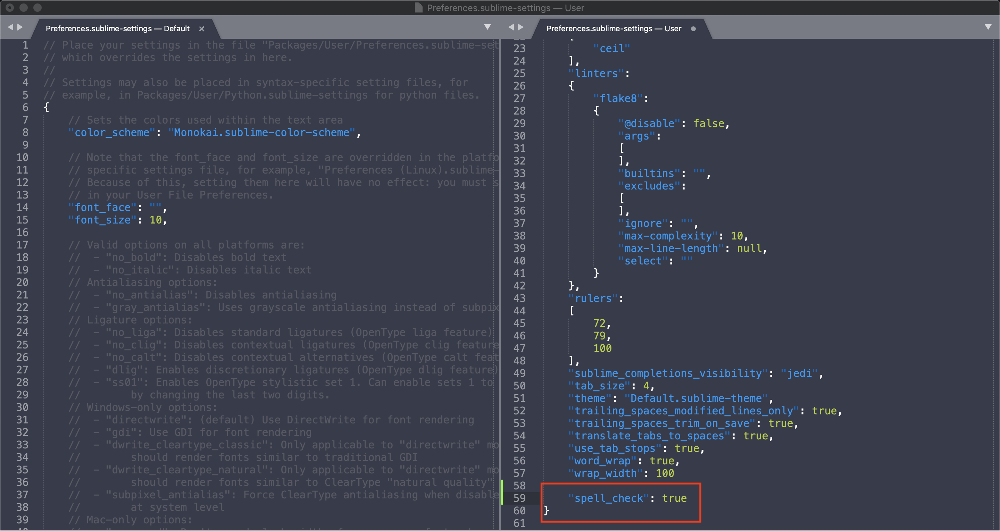
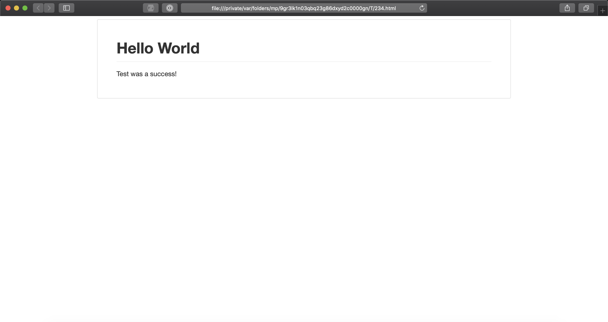

  
# Use Sublime Text 3 for Markdown
  -------------------------------------
Learn how to create beautifully formatted documents using Markdown coupled with Sublime Text 3.

## Markdown
--------

Markdown is quickly becoming the go to language when developers and
non-developers want to create rich formatted web documents. But because
of the goal of Markdown's creators, to make a plain text to HTML
language, Markdown is now being used by more than just web developers.
Markdown can be used to take notes quickly, yet with the ability to
export into a share ready document, headers, lists and links included.

Markdown is actually easy to get started. You can open any text editor,
be it a full word processor like Word, or just the basic Notepad, and
start typing Markdown syntax. Unfortunately, you do not get any of the
nice to have features, such as syntax highlighting and auto-complete, of
the more tech minded text editors. Markdown writers quickly discover
having extra features makes the writing process quicker, shaving time
off of their production schedules.

One might assume that the problem becomes finding a text editor that can
support Markdown, isn't a full fledged development platform, and is
quick to setup. Turns out that is not the problem. The problem is that
there are too many such editors out there! This guide is here to
simplify the decision by showing how to setup a known, and tested, text
editor, Sublime Text 3, to write Markdown syntax.

*One last note, this guide is written assuming that the user is on a MacOS system. If that is not the case, the only difference is that CMD translates to CTRL on a Windows or Linux machine.*

<!-- MarkdownTOC -->

- ## Chapter 1: Sublime Text 3
    - Choosing Sublime Text 3
    - Download Sublime Text 3
    - Install Sublime Text 3
    - Configure Sublime 3
- ## Chapter 2: Markdown in Sublime 3
    - Configure Sublime Text 3 to recognize Markdown
    - Install Markdown Editor
    - Install Markdown Preview
    - Test Markdown
- ## Chapter 3: Markdown Syntax
    - Using Markdown:
    - Using Header
- This is an H1 Header
- This is an H2 Header
    - This is an H3 Header
    - Change font emphasis
    - Create Lists
- ## Conclusion

<!-- /MarkdownTOC -->


## Chapter 1: Sublime Text 3
---------------

### Choosing Sublime Text 3

Sublime Text 3 (ST3) is a text editor that has some important features: 

1. The full version of the program is free. Although you can choose to make a donation to the creator. The only difference between having a licensed copy, and an unlicensed copy is that the unlicensed copy contains a pop-up letting you know that you can choose to pay if you would like. 

2. The editor can be configured to recognize most programing languages, including Markdown.

### Download Sublime Text 3

1.  Go to the [ST3 download page](https://www.sublimetext.com/3).

2.  Download the version of ST3 that corresponds to the computer you want to use the program on.

3.  Save the downloaded file to a destination you will remember, such as the *Downloads folder*, or *Desktop*

### Install Sublime Text 3

1.  Navigate to the location where the install file was saved.

2.  Double click on the file to begin the installation process

3.  Grab a beverage of choice while the program installs...Although it shouldn't take more than a few seconds.

### Configure Sublime 3

1.  Open Settings editor.
    * Navigate to *Preferences -> Settings*, or use keyboard shortcut *CMD + ,*
    * Two files will open up. Find the file labeled *Preferences.sublime-settings - User* 
2.  Turn on Spell Check, which is off by default.
    * At the bottom of the file, before the closing bracket, which looks like this  ***}***, paste:
                    `"spell_check": true` *See Figure 1*

3.  Save file using the file menu, or by using the keyboard short cut *CMD + s*

**Figure 1**


**Sublime Documentation:**
[Settings Editor](https://www.sublimetext.com/docs/3/settings.html)

## Chapter 2: Markdown in Sublime 3
---------------

### Configure Sublime Text 3 to recognize Markdown

With ST3 installed and configured, all that is left is to install the Markdown packages.

### Install Markdown Editor

1.  Navigate to the Command Palette *Tools -> Command Palette* or the keyboard shortcut *CMD + SHIFT + p*

2.  In the search bar enter *package control*
    * Select the option *Package Control: Install Package*

3.  In the next search bar enter *markdown editor*
    * Select the highlighted package
    * Install will happen automatically

4. Restart ST3

### Install Markdown Preview

1.  Navigate to the Command Palette *Tools -> Command Palette* or the keyboard shortcut *CMD + SHIFT + p*

2.  In the search bar enter *package control*
    * Select the option *Package Control: Install Package*

3.  In the next search bar enter *markdown preview*
    * Select the highlighted package
    * Install will happen automatically

4. Restart ST3

### Test Markdown

1.  Create a new file named *helloworld.md*. The **md** extension is used to denote markdown files.

2.  Open the file in ST3

3.  Copy this code to the file

```markdown
# Hello World
Test was a success!
```

4. Save file

5. Navigate to the Command Palette *Tools -> Command Palette* or the keyboard shortcut *CMD + SHIFT + p*

6. In the search bar enter *markdown preview*
   * Select the option *Markdown Preview: Preview in Browser*

7. Default Browser will open and you should see a webpage similar to Figure 2

***Tip:*** If you leave the browser tab open, then you can preview changes by saving the md file and refreshing the browser.

**Figure 2**


## Chapter 3: Markdown Syntax
---------------

### Using Markdown:

Now that Markdown and Markdown Preview are installed and working, here are some simple tips to get started on creating beautiful documents.

### Using Header
Headers are the foundation blocks of Markdown. They give visual indicators of when topics change, and can be linked to using hyperlinks.

A ***#*** denotes a header. A single ***#*** is an H1 header, which is the largest. Adding additional ***#*** will increment the header to the next smallest size.

1. Try an H1 size header
```markdown
# This is an H1 Header
```

2.  Try an H2 size header
```markdown
## This is an H2 Header
```

3.  Try an H3 size header
```markdown
### This is an H3 Header
```

**Output of Header examples:**

# This is an H1 Header
## This is an H2 Header
### This is an H3 Header

### Change font emphasis

Markdown also supports some font emphasis styles**Bold**, *Italic*, and ~~Strike Through~~ 

1.  Make text **Bold**
```markdown
**Bold**
```

2.  Make text *Italicized*
```markdown
*Italics*
```

3.  ~~Strike Through~~ text
```markdown
~~Strike Through~~
```

### Create Lists

Markdown supports both ordered, and unordered lists.

1.  Use * to create an unordered list
```markdown
* This is an unordered item
* This is another unordered item
    * This is a sub item
```

2.  Use numerals to create an ordered list
```markdown
1. This is an ordered item
2. This is another ordered item
    1. This is a sub item
```

3.  Ordered and unordered lists can be combined
```markdown
1. This is an ordered item
    * This is an unordered sub item
* This is an unordered item
    1. This is an ordered sub item
```

**Output of markdown lists:**
* This is an unordered item
* This is another unordered item
    * This is a sub item

1. This is an ordered item
2. This is another ordered item
    1. This is a sub item

1. This is an ordered item
    * This is an unordered sub item
* This is an unordered item
    1. This is an ordered sub item

**Markdown Syntax Reference:**

[Markdown Cheatsheet](https://github.com/adam-p/markdown-here/wiki/Markdown-Cheatsheet)

## Conclusion
----------------

Markdown is a simple, intuitive, plain text language that has many uses. Web developers, programmers, students and academics use the language daily, but the language could be useful to an even wider range of writers. One of the biggest barriers to using Markdown is how many text editor options are available. Even the most minimal editor is sufficient to create a markdown document.

Unfortunately, minimalism has major drawbacks. Individuals who like more modern features, such as syntax highlighting, or are new to programing languages, require something more modern. Sublime Text 3 fits that role.

ST3 can be used as just a simple editor, but can also be equipped with packages that increase its value. As this guide has shown, ST3 is easily configured to become a powerful, and complete Markdown editor that suits anyone. 
